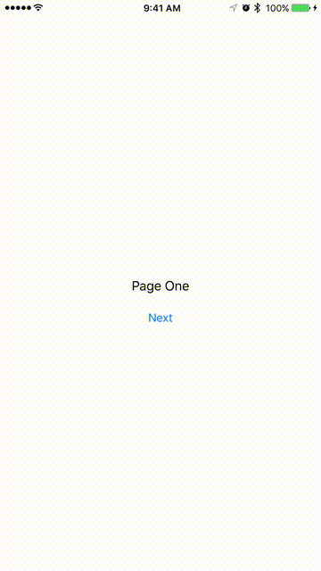

#SideSpringTransition
##A custom animated transition with edge panning
###For non-UINavigationController based view controllers

##Installation
Simply drag the SideSpringTransition folder with the source code into your project, adding them to the proper targets.

##Use

`SideSpringTransitionHomeVC` and `SideSpringTransitionVC` are meant to be subclassed.  While you can use them as concrete classes, they do not offer the flexibility of your own custom view controllers.

See the example code for details on how to use 3D Touch with `SideSpringTransition`.